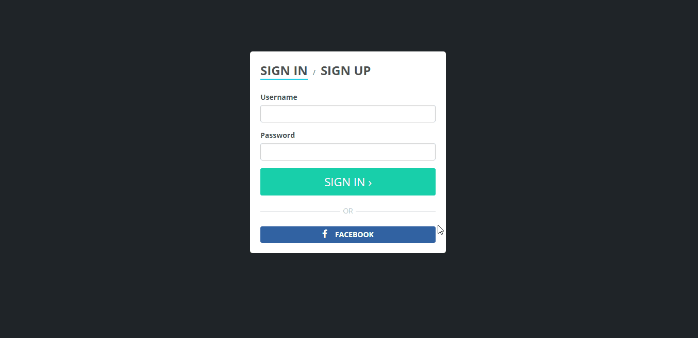

# retube

Retube is a full stack ( react, redux, socket.io, node, mongo ) real time chat application.
The demo version is available: https://chatretube.herokuapp.com .

## Features:
- React, redux, react-router, mongo, node, socket.io
- Authentication using passport.js
- Emoji support
- Group chats
- Create & delete group chats
- Sort & filter group chats
- Mark your favorite chats

## Installation:
1. Set up your local mongodb environment. [Instructions how to install](https://docs.mongodb.org/manual/installation/)
2. Then `git clone https://github.com/abitlog/retube.git && cd retube`
3. Run `npm run dev`
4. Go to `localhost:3000`
5. You might want to use `npm run createdb` just to set up a test db
6. You can configure a config.js file according to your needs

## To do list:
- Advanced user profiles
- Twitter like feed
- Moooooore real time features
- Dashboard
- Private chats
